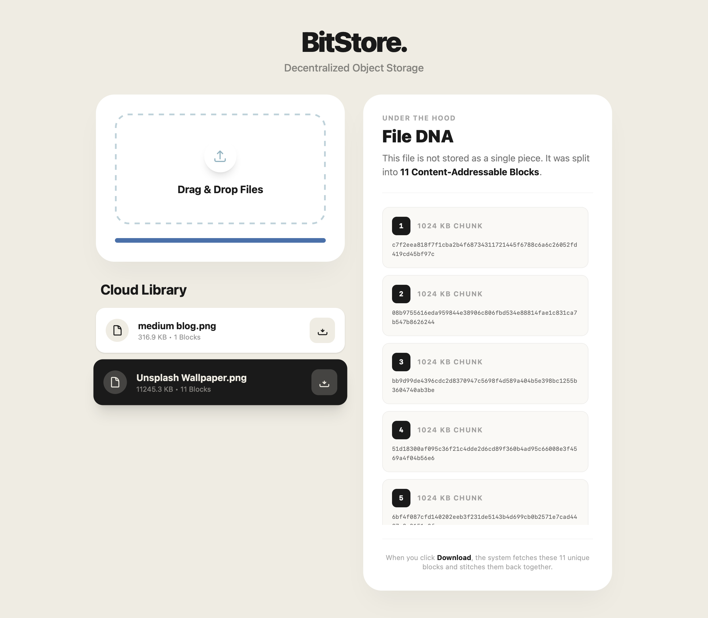

# BitStore



> **Decentralized. Encrypted. Permanent.**

BitStore is a distributed, content-addressable object storage system inspired by principles from IPFS and BitTorrent. It splits files into cryptographically hashed blocks, ensuring data deduplication and integrity verification at the byte level.

Designed as a **Microservices Monorepo**, it decouples the storage plane from the metadata plane, allowing for independent scaling of storage nodes versus file orchestration.

---

## 🧠 How It Works (The Core Logic)

BitStore is not just a file uploader; it is a **Content Addressable Storage (CAS)** engine. Here is the lifecycle of a file:

### 1. ✂️ Chunking (The Split)
When a file is uploaded, the **Metadata Service** does not save it as one blob. Instead, it streams the file and slices it into fixed-size **1MB Blocks**.
* *Why?* This allows us to process massive files without eating up RAM, and enables parallel processing.

### 2. #️⃣ Hashing & Integrity
Each 1MB block is passed through a **SHA-256** cryptographic function.
* The output hash (e.g., `a1b2c3...`) becomes the **Unique ID** of that block.
* This ensures data integrity: if a single bit changes, the hash changes, and the system knows the data is corrupted.

### 3. ♻️ Deduplication (The Magic)
Before storing a block, the system checks: *"Do I already have a block with hash `a1b2c3...`?"*
* **Yes:** We discard the incoming data and simply point the new file to the existing block.
* **No:** We write the new block to the **Block Service**.
* *Result:* If 1,000 users upload the exact same 50MB video, BitStore only stores it **once**, saving 99.9% of storage space.

### 4. 🧩 Re-patching (The Assembly)
To download a file, the system reverses the process:
1.  Look up the "Recipe" (Metadata): *"File X is made of blocks [A, B, C]"*.
2.  Fetch blocks A, B, and C from the storage vault.
3.  Stitch them back together in order and stream the bytes to the user.

---

## 🏗 Architecture

BitStore follows a decoupled microservices architecture:

### **Metadata Service (The Brain)**
* **Stack:** Java 17, Spring Boot, Hibernate.
* **Role:** Maintains the `File Name -> [List of Block Hashes]` mapping. It never touches the raw data on disk, keeping it lightweight and fast.

### **Block Service (The Vault)**
* **Stack:** Java 17, Spring Boot, Local IO.
* **Role:** A "Dumb" storage node. It doesn't know what "File.jpg" is; it only knows it holds a block named `8f4b...`.

### **Frontend (The Interface)**
* **Stack:** React, Vite (Rolldown), Tailwind CSS, Axios.
* **Role:** A "Soft Modern" UI that visualizes the upload queue and handles real-time progress streaming.

---

## 🚀 Getting Started

### Prerequisites
* Java 17+
* Node.js 18+
* Maven Wrapper (Included)

### Installation

1.  **Clone the Repository**
    ```bash
    git clone [https://github.com/YOUR_USERNAME/BitStore.git](https://github.com/YOUR_USERNAME/BitStore.git)
    cd BitStore
    ```

2.  **Start the Microservices**
    * **Terminal 1 (Metadata):** `./mvnw spring-boot:run -p metadataservice`
    * **Terminal 2 (Block Storage):** `./mvnw spring-boot:run -p blockservice`

3.  **Start the Frontend**
    * **Terminal 3 (UI):**
        ```bash
        cd frontend
        npm install
        npm run dev
        ```

4.  **Access the Cloud**
    Open `http://localhost:5173` in your browser.

---

## 📄 License

**Open Source.**
This project is free to use, modify, and distribute. Built by **Harsh Kolarkar**.