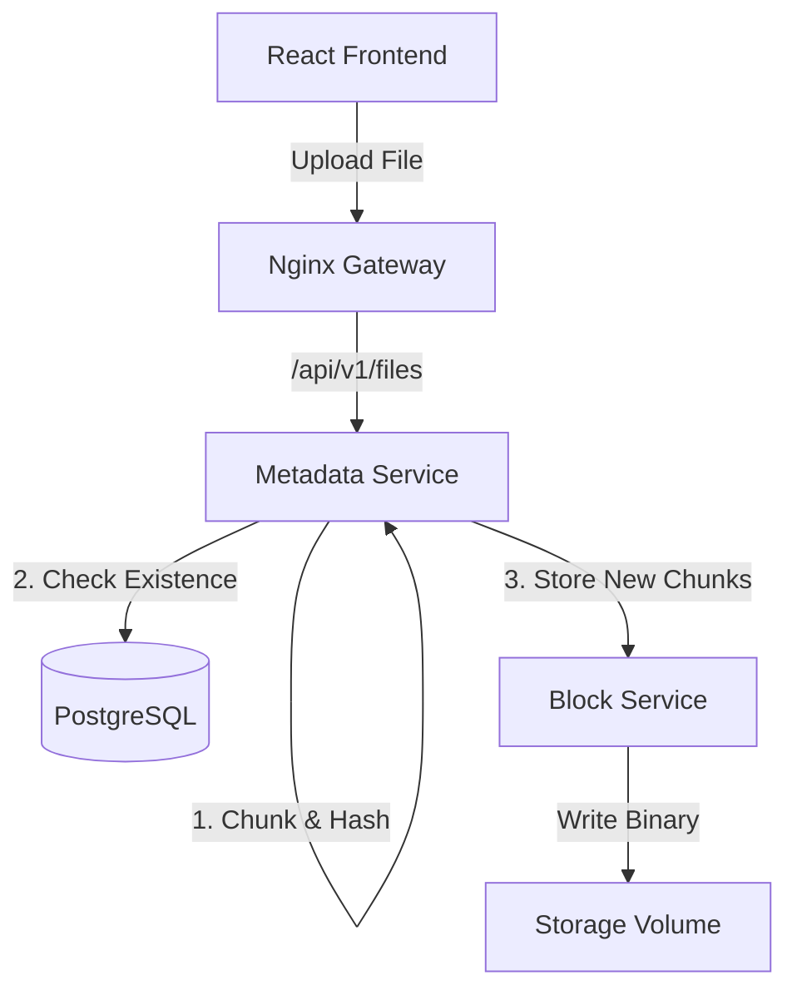

# BitStore 📦

**A Distributed, Content-Addressable Storage (CAS) System.**

BitStore is a scalable object storage engine designed on microservices principles. Unlike traditional storage that organizes files by name/location, BitStore breaks files into 1MB chunks, fingerprints them using SHA-256, and stores them in a deduplicated "Vault."

This project demonstrates the core concepts behind systems like Git, IPFS, and Dropbox's sync engine.


## 🏗️ System Architecture

The system follows a decoupled microservices pattern to separate **Control Plane** (Metadata) from **Data Plane** (Block Storage).



## 🚀 Key Features

* **🧬 File DNA Inspector:** A real-time visualizer that deconstructs files into their constituent blocks, revealing the SHA-256 hash for every 1MB chunk.
* **🔍 Native Deduplication:** By using Content-Addressable Storage (CAS), identical data blocks are stored only once. Uploading the same 1GB file 10 times consumes only 1GB of disk space.
* **⚡ Parallel Architecture:**
    * **Metadata Service:** Handles file logic, user ownership, and the "recipe" of block hashes.
    * **Block Service:** A high-throughput, dumb storage unit that operates purely on hash keys (immutable storage).
* **🐳 Dockerized Infrastructure:** Fully containerized environment using Docker Compose with an Nginx reverse proxy handling traffic routing.

## 🛠️ Tech Stack

| Component | Technology | Role |
| :--- | :--- | :--- |
| **Frontend** | React, Vite, Tailwind | Drag-and-drop UI & Block Visualization |
| **Gateway** | Nginx | Reverse Proxy & CORS handling |
| **Metadata API** | Java 17, Spring Boot | Business logic & Metadata orchestration |
| **Block API** | Java 17, Spring Boot | Binary storage & retrieval |
| **Database** | PostgreSQL 15 | Relational data & Indexing |
| **DevOps** | Docker Compose | Container orchestration |

## 🧠 Engineering Decisions & Trade-offs

* **Why Split Metadata & Block Services?**
    Separating the "Brain" (Metadata) from the "Vault" (Blocks) allows them to scale independently. The Block Service is I/O bound and can be scaled horizontally across multiple servers (or replaced with S3), while the Metadata Service is CPU/Memory bound and focuses on database transactions.

* **Why Content-Addressable Storage (CAS)?**
    CAS ensures data integrity. If a single bit in a file changes, the hash changes, and it becomes a new object. This automatically provides versioning capabilities and deduplication, drastically reducing storage costs for redundant data.

## 🏁 Getting Started

Run the entire distributed system locally with one command.

### Prerequisites
* Docker & Docker Compose installed.

### Installation

1.  **Clone the repository**
    ```bash
    git clone [https://github.com/Archnightt/BitStore.git](https://github.com/Archnightt/BitStore.git)
    cd BitStore
    ```

2.  **Launch the System**
    ```bash
    docker-compose up --build
    ```

3.  **Explore**
    Open **http://localhost:5173** to access the dashboard.

## 🧪 Testing the "File DNA"
1.  **Upload a File:** Drag and drop a large file (e.g., `Photo.jpg`).
2.  **Inspect it:** Click the file card to open the **Inspector**. Observe the unique hashes.
3.  **Upload it Again:** Drag the *same* file in again.
4.  **Compare:** Inspect the second copy. You will see it shares the **exact same block hashes**—deduplication in action.

---
*Built by [Archnightt](https://github.com/Archnightt) as a high-performance distributed systems prototype.*
